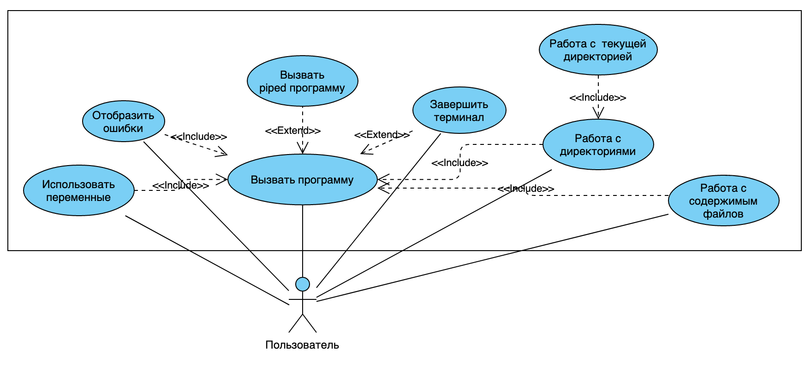
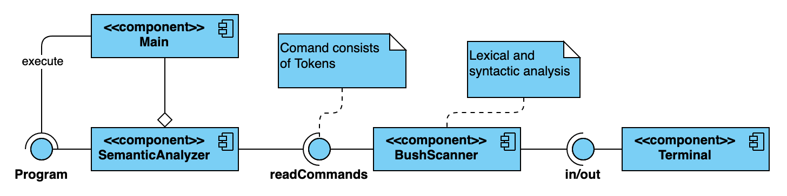
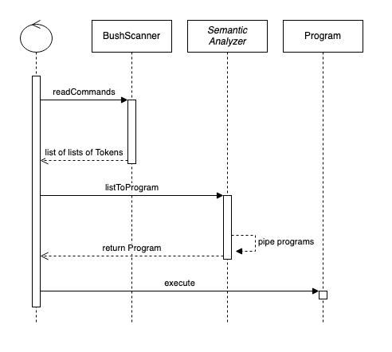

# CLI as a homework for Software Design discipline

## Запуск программы

`bash$ ./gradlew`


## Описание реализации

### Алгоритм


### Алгоритм работы BushScanner


## Структура классов

```
ru.ifmo.jb.hw.sdcli
│   Main - entry point
│   BushScanner - input form console and parsing
│   Token – alias for String
│   
└── programs
    │   Program - abstract class that can execute() with input and output streams for piping
    │   'Some'Program - alternative program to shell program
    │   OuterProgram - executes actual program from bash
    │   NoneProgram - useful stub
```

### Program и его наследники


### Что есть Token?


## UML (ДЗ №4)

### Диаграмма случаев использования



### Диаграмма компонентов



### Диаграммы последовательностей

